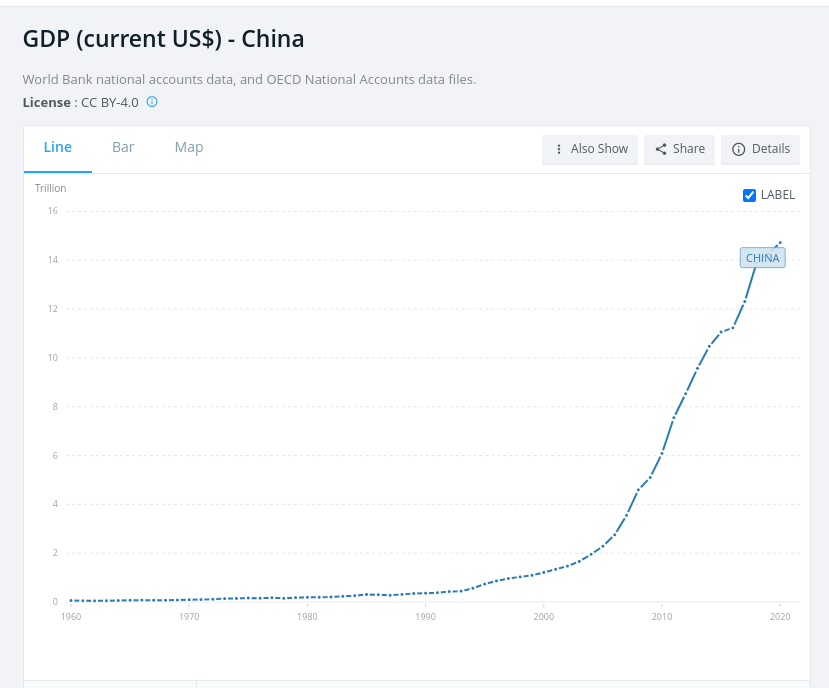

# Fourth session

compare gapminder wide vs long

gap_wide \<- read_csv("[https://bit.ly/gapminder-rsu")](https://bit.ly/gapminder-rsu%22))

Load the packages

```{r}
pacman::p_load(tidyverse, # several datascience packages
               palmerpenguins, # data
               gapminder, #data,
               gtsummary) # for tables) 
```

```{r}
gap_wide <- read_csv("https://bit.ly/gapminder-rsu")
```

## Data basics

#### Filtering

Filter by species == Adelie


```{r}
penguins %>% 
  filter(species == "Adelie")
```

Filter by two conditions Adelie & island == Dream

Filter body_mass_g \< 3000

```{r}
penguins %>% 
  filter(species == "Adelie" & island != "Torgersen")
```

You can use other operators beyond just the `==` operator that tests for equality:

-   `>` corresponds to "greater than"

-   `<` corresponds to "less than"

-   `>=` corresponds to "greater than or equal to"

-   `<=` corresponds to "less than or equal to"

-   `!=` corresponds to "not equal to." The `!` is used in many programming languages to indicate "not."

[`&`](https://rdrr.io/r/base/Logic.html) is "and", [`|`](https://rdrr.io/r/base/Logic.html) is "or", and [`!`](https://rdrr.io/r/base/Logic.html) is "not".

TASK: Adelie but not from Torgersen

TASK Adelie or Gentto

\|

```{r}
penguins %>% 
  filter(species == "Adelie" | species == "Gentoo")
```

Another way, using %in%

```{r}
penguins %>% 
  filter(species %in% c("Adelie", "Gentoo"))
```

TASK

Filter all penguins from Torgersen weighing more than 3500g

#### Mutate

Create new variables

bill_ratio = bill_length_mm / bill_depth_mm

```{r}
penguins %>% 
  mutate(bill_ratio = bill_length_mm / bill_depth_mm)
```

Relocate after island column

```{r}
penguins %>% 
  mutate(bill_ratio = bill_length_mm / bill_depth_mm) %>% 
  relocate(bill_ratio, .after = island)
```

TASK

```{r}
penguins %>% 
  mutate(body_mass_k = log10(body_mass_g))
```

#### Grouping and summarizing data

calculate the mean body_mass_g by specie

```{r}
penguins %>% 
  group_by(species) %>% 
  # now I will remove the NAs values
  drop_na() %>% 
  # and now the summary of the variable
  summarise(n = n(), 
            mean = mean(body_mass_g),
            sd = sd(body_mass_g), 
            max = max(body_mass_g), 
            min = min(body_mass_g)) %>% 
  mutate(across(where(is.numeric), ~ round(., 1)))
```

Dealing with NAs

na.rm = T

drop_na()

```{r}
penguins %>% 
  group_by(species) %>% 
  drop_na() %>% 
  summarise(median = median(flipper_length_mm), 
            sd = sd(flipper_length_mm)) %>% 
  mutate(across(where(is.numeric), ~ round(., 1)))
```

## Wide vs long format

### Load data

```{r}
gap_wide <- read_csv("https://bit.ly/gapminder-rsu")
```

### Explore the data

How many variables?



Filter China

```{r}

```

How to plot ?

### Wide vs long


-   Wide data is for humans

-   Long data is for computers


#### Wide to long

gdp

```{r}
gap_wide %>% 
  select(continent:gdpPercap_2007) %>% 
  pivot_longer(cols = gdpPercap_1952:gdpPercap_2007, 
               names_to = "gdp_year", 
               values_to = "gdp_value") %>% 
  filter(country == "China") %>% 
  ggplot(aes(x = gdp_year, 
             y = gdp_value, 
             group = country)) + 
  geom_line()
```

try to plot

```{r}

```

Filter only China

```{r}

```

Conects the points

```{r}

```

Filter Europe and conects the points

```{r}

```

## Split-apply-combine


Now, we will use the long gapminder dataset

### Question: how has GDP per continent evolved per year?

```{r}
gapminder %>% 
  filter(year == 2007) %>% 
  group_by(continent) %>% 
  summarise(mean_gdp = mean(gdpPercap), 
            mean_pop = mean(pop), 
            mean_lifeexp = mean(lifeExp), 
            n = n())
```

```{r}
gapminder %>% 
  group_by(continent, year) %>% 
  summarise(gdp_mean = mean(gdpPercap)) %>% 
  ggplot(aes(x = year, 
             y = gdp_mean, 
             color = continent)) + 
  geom_line() + 
  scale_y_log10()
```

### Question: how has POPULATION per continent evolved per year?

Hint: Try log10

## Example: Vaccinations Latvia

Homework: See [\<https://github.com/owid/covid-19-data/tree/master/public/data/vaccinations\>](https://github.com/owid/covid-19-data/tree/master/public/data/vaccinations){.uri}

```{r}
covid_vac <- read_csv("https://github.com/owid/covid-19-data/raw/master/public/data/vaccinations/vaccinations.csv")
```

```{r}
covid_vac %>% 
  filter(location == "Latvia") %>% 
  ggplot(aes(x = date, 
             y = total_vaccinations)) + 
  geom_point() 
```

# extra material

## dataexplorer

```{r}
pacman::p_load(DataExplorer)
```

Convert year to factor or chr

```{r}
penguins <- penguins %>% 
  mutate(year = as.character(year))
```

```{r}
DataExplorer::create_report(penguins)
```

## janitor

```{r}
pacman::p_load(janitor, 
               readxl)
```

See <http://sfirke.github.io/janitor/>

```{r}
roster_raw <- readxl::read_excel("https://github.com/sfirke/janitor/blob/main/dirty_data.xlsx?raw=true") # available at http://github.com/sfirke/janitor
```

    roster_raw <- read_excel(here("dirty_data.xlsx")) # available at http://github.com/sfirke/janitor

# etc

## babynames

```{r}
pacman::p_load(babynames)
```

```{r}
data("babynames")
```

```{r}
glimpse(babynames)
```

```{r}
head(babynames)
```

```{r}
babynames %>% 
  ggplot(aes(x = year, 
             y = prop, 
             group = name)) + 
  geom_line()
```

## 
