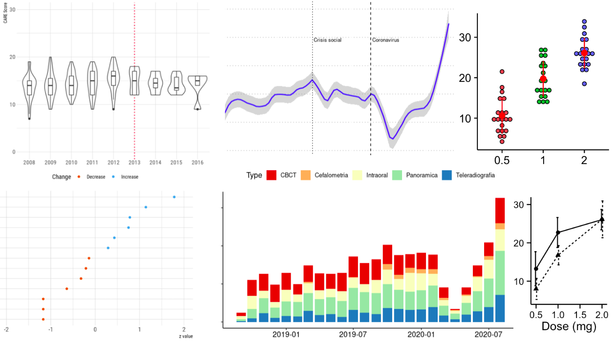

```{r setup, include=FALSE}
knitr::opts_chunk$set(echo = TRUE)
```



+ Contact: 	sergio.uribe@rsu.lv
+ Language:	English
+ Target audience:	Doctoral and Master Students
+ Place: 		Dzirciema iela 16, Rīga, LV-1007 Senāta zāle
+ Course materials:	https://github.com/sergiouribe/Introduction-to-Data-Science-RSU


## OBJECTIVE
The traditional approach to research programmes is to assume that students will find a way to analyse and visualise their data. This assumption brings problems for the students, their supervisors and a significant waste of time. Many students are scared by the data rather than curious and usually skip exploratory data analysis and go straight to advanced statistical models that they cannot explain later because they do not understand their data in depth. This course aims to provide basic knowledge, skills and tools to perform such an exploratory data analysis, with a major focus on publication-ready data visualisation to detect patterns and trends in the data, to extract meaningful information from the data and to prepare for further inferential analysis.  

## LEARNING OUTCOMES
On successful completion of the course, the students will be able to understand/perform:

### Knowledge

+ Exploratory Data Analysis
+ Grammar of graphics
+ Data Management
+ Reproducibility 


### Skills and Tools

+ Master the RStudio interface
+ Install additional packages
+ Identify the formats of the tidy data structure
+ How to deal with errors in coding and search for answers
+ Identify an optimal strategy for collecting and exporting data: Forms, Spreadsheets, CSV 
+ Import their data into R
+ Perform an initial exploratory data analysis: head, dim, NA values, cross-tabulation
+ Identify basic data visualisation options: columns, points, histograms, bar- and boxplots
+ Generate summary tables
+ Use repositories to maintain, manage and share their data: GIT, OSF
+ Export the results of the exploratory analysis: Rmarkdown
+ Good practices in data organisation, naming and coding


### Competence

On successful completion of the course, the students will have the knowledge and practical skills to successfully apply R and its essential functions and packages to wrangle and transform their research data to perform informative exploratory analyses and perform publication-ready visualisation of their data, enabling effective interpretation and communication of the research results and findings to the scientific community.

## COURSE APPROVAL
To approve the course, each student must present a final project and code script with the exploratory analysis of data from an original dataset of their choice.

## PRE-REQUISITES
 + [Read Chapter 1 Getting Started with Data in R, From ModernDive](https://moderndive.com/1-getting-started.html)
 + [Hans Rosling visualizations Ted Talk](https://www.ted.com/talks/hans_rosling_the_best_stats_you_ve_ever_seen?language=en)

### SOFTWARE AND PACKAGES REQUIRED 

Please tune into class with a laptop that has the following installed:


<aside>
On the day of the class, we'll provide you with a link to an RStudio Cloud project that contains all of the course materials. 
</aside>

* A recent version of R (>=3.9.0), which is available for free at <https://cran.r-project.org/>

* A recent version of RStudio Desktop (>=1.3.0), available for free at <https://www.rstudio.com/download> (RStudio Desktop Open Source License)

* The R packages we will use, which you can install by connecting to the internet, opening RStudio, and running at the command line:

    ```{r echo=TRUE, eval = FALSE}
    install.packages(c("tidyverse", "gtsummary", 
      			             "janitor", "ggpubr", 
                       "ggthemes", "naniar", "NHANES", "gapminder"))

    ```
    
## Sessions

| Session 	| Theme                      	| Contents                                                                                                                                                                                                                                  	|
|---------	|----------------------------	|-------------------------------------------------------------------------------------------------------------------------------------------------------------------------------------------------------------------------------------------	|
| 1       	| Data Visualization: Why    	|  - Introduction to R  - The grammar of graphics: data, geoms, aes  - Basic visualisations  - How to deal with errors                                                                                                                      	|
| 2       	| Data Visualization II: How 	| geom_points   - geom_histogram   - geom_col   - geom_bar   - facets   - Locating and dealing with NA                                                                                                                                                          	|
| 3       	| Data Wrangling: Why        	| Filter   - Select   - Mutate   - Summarise I   - Arrange  - lubridate                                                                                                                                                                                                	|
| 4       	| Data Wrangling II: How     	| Pivoting   - group_by   - Summarise II   - gtsummary                                                                                                                                                                                                  	|
| 5       	| Data Management            	| GIT, OSF   - Data workflow: data validation, data form entry, when and when not to use spreadsheets   - Files naming   - Basic of coding management: tidylog   - Basic of data cleaning: janitor   - Good code practices and data sharing Codebook (dataMaid) 	|
| 6       	| Final project              	| Students presentations, 15 min per project, max 6 project                                                                                                                                                                                 	|

## LECTURES

### Compulsory

+ Broman, K.W., Woo, K.H., 2017. [Data organization in spreadsheets (No. e3183v1)](https://peerj.com/preprints/3183/). PeerJ Preprints. doi:10.7287/peerj.preprints.3183v1
+ Ellis, S.E., Leek, J.T., 2017. [How to share data for collaboration (No. e3139v5).](https://peerj.com/preprints/3139/) PeerJ Preprints. 
+ Vickers, A.J., Assel, M.J., Sjoberg, D.D., Qin, R., Zhao, Z., Koyama, T., Botchway, A., Wang, X., Huo, D., Kattan, M., Zabor, E.C., Harrell, F., 2020. [Guidelines for Reporting of Figures and Tables for Clinical Research in Urology.](https://www.sciencedirect.com/science/article/pii/S030228382030316X) Eur. Urol. doi:10.1016/j.eururo.2020.04.048
+ O’Donoghue, S.I., Baldi, B.F., Clark, S.J., Darling, A.E., Hogan, J.M., Kaur, S., Maier-Hein, L., McCarthy, D.J., Moore, W.J., Stenau, E., Swedlow, J.R., Vuong, J., Procter, J.B., 2018. Visualization of Biomedical Data. Annu. Rev. Biomed. Data Sci. 1, 275–304. (https://www.annualreviews.org/doi/full/10.1146/annurev-biodatasci-080917-013424)
+ [Tidy Data](https://www.jstatsoft.org/article/view/v059i10) | Wickham | Journal of Statistical Software [WWW Document], n.d.
+ Wilson, G., Bryan, J., Cranston, K., Kitzes, J., Nederbragt, L., Teal, T.K., 2017. [Good enough practices in scientific computing.](https://journals.plos.org/ploscompbiol/article?id=10.1371/journal.pcbi.1005510) PLoS Comput. Biol. 13, e1005510.
<<<<<<< HEAD
+ Rost, Lisa. 2020. [Colors for data visualization](https://blog.datawrapper.de/colors/) and [How to pick more beautiful colors for your data visualizations](https://blog.datawrapper.de/beautifulcolors/)
=======
+ Rost, Lisa. 2020. [How to pick more beautiful colors for your data visualizations](https://blog.datawrapper.de/beautifulcolors/)
>>>>>>> 6b71fd2fe72dfbe6237ce777587d54444fac6bf5

### Recommended

#### Tutorial (recommended)
 + [What is GitHub](https://guides.github.com/activities/hello-world/)  
 + [Rstudio interface](https://www.pipinghotdata.com/posts/2020-09-07-introducing-the-rstudio-ide-and-r-markdown/)

### Data Science Books (required some chapters)
+ Healy, K., 2018. [Data Visualization: A Practical Introduction](https://socviz.co/), 1 edition. Ed. Princeton University Press.
+ Wickham, H., Grolemund, G. [R for Data Science: Import, Tidy, Transform, Visualize, and Model Data](https://r4ds.had.co.nz/), Edición: 1. ed. O’Reilly Media.
+ [Book selection about R](https://www.bigbookofr.com/)


### Communities, Blogs and Q&A (recommended)
 + [Newest 'r' Questions ](https://stackoverflow.com/questions/tagged/r)
 + [RStudio Community](https://community.rstudio.com/)
 + [Simply Statistics](https://simplystatistics.org/)
 + Twitter [#TidyTuesday](https://twitter.com/search?q=%23TidyTuesday)
 + [Dental Data Science](https://dentaldatascience.org/)
 + [Tidyverse.org](https://www.tidyverse.org/)
 + Data Sciences courses from [Coursera](https://www.coursera.org/browse/data-science) and [EdX](https://www.edx.org/course/subject/data-science)
 + [Ten Tidyverse tricks](https://www.youtube.com/watch?v=NDHSBUN_rVU) 
 + [The Lesser Known Stars of the Tidyverse](https://www.youtube.com/watch?v=ax4LXQ5t38k) 
 + [Tidyverse tips in R ](https://www.youtube.com/watch?v=ZM04jn95YP0)(
 + [Effective Data Visualisation](https://cwd.numbat.space/lectures/lecture-06.html#1)


### Additional Books (recommended)
+ Rosling, H., Rönnlund, A.R., Rosling, O., 2018. Factfulness: Ten Reasons We’re Wrong About the World--and Why Things Are Better Than You Think. Flatiron Books.
+ Peng, R.D., Matsui, E., 2017. The Art of Data Science.


